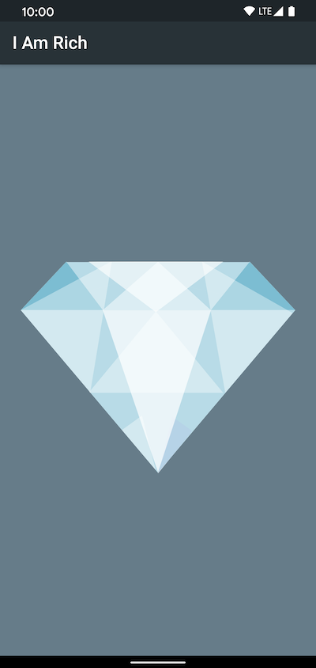

# I Am Rich!
Another demo flutter app as I explore the framework and sdk.

This app is a clone of an ancient iOS app that charged people a
crazy amount of money for an app that simply displays a gem stone. 💎

### Screenshots

## Getting Started
### Prerequisites
- Android Studio, VSCode or IntelliJ IDEA
- Dart Plugin
- Flutter SDK

### Installing
1. Clone or download the repo
2. Import the project into your favorite IDE (listed above)
3. Have fun!
### Resources
Learn more about Flutter, the open-source mobile application development SDK created by Google
- [flutter.io](https://flutter.io)
- [Lab: Write your first Flutter app](https://flutter.io/docs/get-started/codelab)
- [Cookbook: Useful Flutter samples](https://flutter.io/docs/cookbook)

For help getting started with Flutter, view the 
[online documentation](https://flutter.io/docs), which offers tutorials, 
samples, guidance on mobile development, and a full API reference

## Thanks
These demos are inspired by a course on Flutter development by
[The App Brewery](https://flutter.dev/docs/get-started/codelab).
All thanks to Angela Yu and the team there for the content, as well as, 
the rest of the community for answering questions and posting guides on StackOverflow, Reddit,
Medium, and everywhere else! 🙏🦄