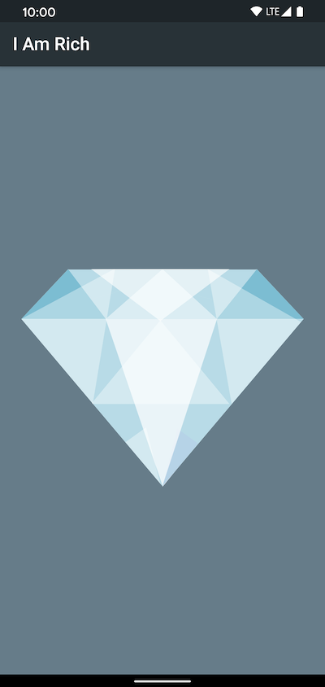

# I Am Rich!

Another demo flutter app as I explore the framework and sdk.

This app is a clone of an ancient iOS app that charged people a
crazy amount of money for an app that simply displays a gem stone. 💎

## Getting Started

This project is a starting point for a Flutter application.

A few resources to get you started if this is your first Flutter project:

- [Lab: Write your first Flutter app](https://flutter.dev/docs/get-started/codelab)
- [Cookbook: Useful Flutter samples](https://flutter.dev/docs/cookbook)

For help getting started with Flutter, view our
[online documentation](https://flutter.dev/docs), which offers tutorials,
samples, guidance on mobile development, and a full API reference.

## Thanks

These demos are inspired by a course on Flutter development by
[The App Brewery!](https://flutter.dev/docs/get-started/codelab)
All thanks to Angela Yu and the team there for the content, as well as, 
the rest of the community for answering questions on StackOverflow, Reddit,
and everywhere else! 🙏🦄